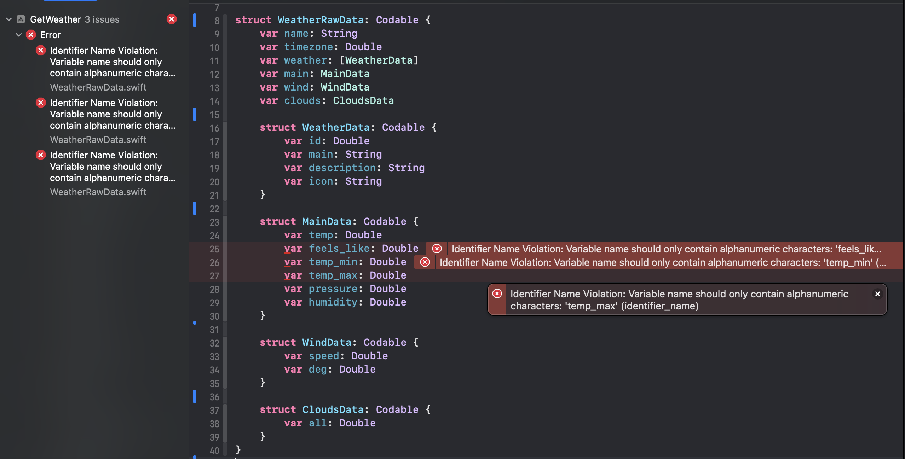

# 用SwiftLint保持Swift风格一致

代码风格可能是一个有争议的话题，并且在开发人员之间引发一些激烈的讨论。使用工具强制执行一套代码风格规则对于避免一些争论，以及确保在整个项目中保持代码风格的一致性非常有帮助。SwiftLint 可以很容易的整合进 Xcode 项目中，以便在编译时将代码风格冲突标记为警告或者错误。

---

# 使用 Xcode 集成 SwiftLint

你可以在 Github上 获得[SwiftLint](https://github.com/realm/SwiftLint)。它可以使用多种方式安装，比如，直接下载 SwiftLint.pkg 包，或者使用[HomeBrew](https://brew.sh/)命令行。

```bash
brew install swiftlint
```

安装 SwiftLint 后，可以通过在主 app target 的`Build Phase`（构筑阶段）下添加一个`Run Phase`（运行阶段）的运行脚本，来集成进 Xcode 项目。点击`+`号按钮，选择"New Run Script Phase"，添加下面的脚本。在 silicon Macs （搭载M1芯片）上需要添加`export`语句，因为`HomeBrew`的二进制文件默认安装在`/opt/homebrew/bin`目录之下。

> 译者注：并不一定在此目录下，具体可以点击[这里](https://mkyong.com/mac/where-does-homebrew-install-packages-on-mac/)。
> 

```bash
export PATH="$PATH:/opt/homebrew/bin"
if which swiftlint > /dev/null; then
  swiftlint
else
  echo "warning: SwiftLint not installed, download from https://github.com/realm/SwiftLint"
fi
```


在 Xcode 添加运行脚本以集成 SwiftLint

---

# **SwiftLint 的规则冲突**

好消息是，新建的 Xcode 项目没有违反 SwiftLint 的默认规则。一旦你知道了 SwiftLint，最好从一开始就立即将其添加到每个项目中。在刚才新建的 iOS App 的`Text view`后面添加一个空格。现在，编译代码时会生成警告。

```swift
struct ContentView: View {
    var body: some View {
        VStack {
            Text("Hello, world!") 

            Text("second line")

            Spacer()
        }
    }
}
```

这段代码违反了`trailing_whitespace`规则，它默认是开启的。

```bash
+------------------------------------------+--------+-------------+------------------------+-------------+----------+---------------+
| identifier                               | opt-in | correctable | enabled in your config | kind        | analyzer | configuration |
+------------------------------------------+--------+-------------+------------------------+-------------+----------+---------------+
| trailing_whitespace                      | no     | yes         | yes                    | style       | no       | warning, i... |
```


Swift 正在警告在一行之后有一个额外的空格

---

# SwiftLint 的规则

SwiftLint 包含了200多条规则，并且 Swift 社区仍在不间断的贡献更多的规则。查看 SwiftLint 规则的一种方法是在终端中运行`swiftlint rules`命令（此种方式需要安装`swiftlint`）。这将会显示规则以及规则的一系列属性，比如是否可选，是否可纠正。

以下是 SwiftLint 0.46.5的默认规则：

```bash
swiftlint rules
+------------------------------------------+--------+-------------+------------------------+-------------+----------+---------------+
| identifier                               | opt-in | correctable | enabled in your config | kind        | analyzer | configuration |
+------------------------------------------+--------+-------------+------------------------+-------------+----------+---------------+
| anonymous_argument_in_multiline_closure  | yes    | no          | no                     | idiomatic   | no       | warning       |
| anyobject_protocol                       | yes    | yes         | no                     | lint        | no       | warning       |
| array_init                               | yes    | no          | no                     | lint        | no       | warning       |
| attributes                               | yes    | no          | no                     | style       | no       | warning, a... |
| balanced_xctest_lifecycle                | yes    | no          | no                     | lint        | no       | warning       |
| block_based_kvo                          | no     | no          | yes                    | idiomatic   | no       | warning       |
| capture_variable                         | yes    | no          | no                     | lint        | yes      | warning       |
| class_delegate_protocol                  | no     | no          | yes                    | lint        | no       | warning       |
| closing_brace                            | no     | yes         | yes                    | style       | no       | warning       |
| closure_body_length                      | yes    | no          | no                     | metrics     | no       | warning: 2... |
| closure_end_indentation                  | yes    | yes         | no                     | style       | no       | warning       |
| closure_parameter_position               | no     | no          | yes                    | style       | no       | warning       |
| closure_spacing                          | yes    | yes         | no                     | style       | no       | warning       |
| collection_alignment                     | yes    | no          | no                     | style       | no       | warning, a... |
| colon                                    | no     | yes         | yes                    | style       | no       | warning, f... |
| comma                                    | no     | yes         | yes                    | style       | no       | warning       |
| comment_spacing                          | no     | yes         | yes                    | lint        | no       | warning       |
| compiler_protocol_init                   | no     | no          | yes                    | lint        | no       | warning       |
| computed_accessors_order                 | no     | no          | yes                    | style       | no       | warning, o... |
| conditional_returns_on_newline           | yes    | no          | no                     | style       | no       | warning, i... |
| contains_over_filter_count               | yes    | no          | no                     | performance | no       | warning       |
| contains_over_filter_is_empty            | yes    | no          | no                     | performance | no       | warning       |
| contains_over_first_not_nil              | yes    | no          | no                     | performance | no       | warning       |
| contains_over_range_nil_comparison       | yes    | no          | no                     | performance | no       | warning       |
| control_statement                        | no     | yes         | yes                    | style       | no       | warning       |
| convenience_type                         | yes    | no          | no                     | idiomatic   | no       | warning       |
| custom_rules                             | no     | no          | no                     | style       | no       | user-defin... |
| cyclomatic_complexity                    | no     | no          | yes                    | metrics     | no       | warning: 1... |
| deployment_target                        | no     | no          | yes                    | lint        | no       | warning, i... |
| discarded_notification_center_observer   | yes    | no          | no                     | lint        | no       | warning       |
| discouraged_assert                       | yes    | no          | no                     | idiomatic   | no       | warning       |
| discouraged_direct_init                  | no     | no          | yes                    | lint        | no       | warning, t... |
| discouraged_none_name                    | yes    | no          | no                     | idiomatic   | no       | warning       |
| discouraged_object_literal               | yes    | no          | no                     | idiomatic   | no       | warning, i... |
| discouraged_optional_boolean             | yes    | no          | no                     | idiomatic   | no       | warning       |
| discouraged_optional_collection          | yes    | no          | no                     | idiomatic   | no       | warning       |
| duplicate_enum_cases                     | no     | no          | yes                    | lint        | no       | error         |
| duplicate_imports                        | no     | no          | yes                    | idiomatic   | no       | warning       |
| duplicated_key_in_dictionary_literal     | no     | no          | yes                    | lint        | no       | warning       |
| dynamic_inline                           | no     | no          | yes                    | lint        | no       | error         |
| empty_collection_literal                 | yes    | no          | no                     | performance | no       | warning       |
| empty_count                              | yes    | no          | no                     | performance | no       | error, onl... |
| empty_enum_arguments                     | no     | yes         | yes                    | style       | no       | warning       |
| empty_parameters                         | no     | yes         | yes                    | style       | no       | warning       |
| empty_parentheses_with_trailing_closure  | no     | yes         | yes                    | style       | no       | warning       |
| empty_string                             | yes    | no          | no                     | performance | no       | warning       |
| empty_xctest_method                      | yes    | no          | no                     | lint        | no       | warning       |
| enum_case_associated_values_count        | yes    | no          | no                     | metrics     | no       | warning: 5... |
| expiring_todo                            | yes    | no          | no                     | lint        | no       | (approachi... |
| explicit_acl                             | yes    | no          | no                     | idiomatic   | no       | warning       |
| explicit_enum_raw_value                  | yes    | no          | no                     | idiomatic   | no       | warning       |
| explicit_init                            | yes    | yes         | no                     | idiomatic   | no       | warning       |
| explicit_self                            | yes    | yes         | no                     | style       | yes      | warning       |
| explicit_top_level_acl                   | yes    | no          | no                     | idiomatic   | no       | warning       |
| explicit_type_interface                  | yes    | no          | no                     | idiomatic   | no       | warning, e... |
| extension_access_modifier                | yes    | no          | no                     | idiomatic   | no       | warning       |
| fallthrough                              | yes    | no          | no                     | idiomatic   | no       | warning       |
| fatal_error_message                      | yes    | no          | no                     | idiomatic   | no       | warning       |
| file_header                              | yes    | no          | no                     | style       | no       | warning, r... |
| file_length                              | no     | no          | yes                    | metrics     | no       | warning: 4... |
| file_name                                | yes    | no          | no                     | idiomatic   | no       | (severity)... |
| file_name_no_space                       | yes    | no          | no                     | idiomatic   | no       | (severity)... |
| file_types_order                         | yes    | no          | no                     | style       | no       | warning, o... |
| first_where                              | yes    | no          | no                     | performance | no       | warning       |
| flatmap_over_map_reduce                  | yes    | no          | no                     | performance | no       | warning       |
| for_where                                | no     | no          | yes                    | idiomatic   | no       | warning       |
| force_cast                               | no     | no          | yes                    | idiomatic   | no       | error         |
| force_try                                | no     | no          | yes                    | idiomatic   | no       | error         |
| force_unwrapping                         | yes    | no          | no                     | idiomatic   | no       | warning       |
| function_body_length                     | no     | no          | yes                    | metrics     | no       | warning: 4... |
| function_default_parameter_at_end        | yes    | no          | no                     | idiomatic   | no       | warning       |
| function_parameter_count                 | no     | no          | yes                    | metrics     | no       | warning: 5... |
| generic_type_name                        | no     | no          | yes                    | idiomatic   | no       | (min_lengt... |
| ibinspectable_in_extension               | yes    | no          | no                     | lint        | no       | warning       |
| identical_operands                       | yes    | no          | no                     | lint        | no       | warning       |
| identifier_name                          | no     | no          | yes                    | style       | no       | (min_lengt... |
| implicit_getter                          | no     | no          | yes                    | style       | no       | warning       |
| implicit_return                          | yes    | yes         | no                     | style       | no       | warning, i... |
| implicitly_unwrapped_optional            | yes    | no          | no                     | idiomatic   | no       | warning, m... |
| inclusive_language                       | no     | no          | yes                    | style       | no       | warning, a... |
| indentation_width                        | yes    | no          | no                     | style       | no       | severity: ... |
| inert_defer                              | no     | no          | yes                    | lint        | no       | warning       |
| is_disjoint                              | no     | no          | yes                    | idiomatic   | no       | warning       |
| joined_default_parameter                 | yes    | yes         | no                     | idiomatic   | no       | warning       |
| large_tuple                              | no     | no          | yes                    | metrics     | no       | warning: 2... |
| last_where                               | yes    | no          | no                     | performance | no       | warning       |
| leading_whitespace                       | no     | yes         | yes                    | style       | no       | warning       |
| legacy_cggeometry_functions              | no     | yes         | yes                    | idiomatic   | no       | warning       |
| legacy_constant                          | no     | yes         | yes                    | idiomatic   | no       | warning       |
| legacy_constructor                       | no     | yes         | yes                    | idiomatic   | no       | warning       |
| legacy_hashing                           | no     | no          | yes                    | idiomatic   | no       | warning       |
| legacy_multiple                          | yes    | no          | no                     | idiomatic   | no       | warning       |
| legacy_nsgeometry_functions              | no     | yes         | yes                    | idiomatic   | no       | warning       |
| legacy_objc_type                         | yes    | no          | no                     | idiomatic   | no       | warning       |
| legacy_random                            | yes    | no          | no                     | idiomatic   | no       | warning       |
| let_var_whitespace                       | yes    | no          | no                     | style       | no       | warning       |
| line_length                              | no     | no          | yes                    | metrics     | no       | warning: 1... |
| literal_expression_end_indentation       | yes    | yes         | no                     | style       | no       | warning       |
| lower_acl_than_parent                    | yes    | no          | no                     | lint        | no       | warning       |
| mark                                     | no     | yes         | yes                    | lint        | no       | warning       |
| missing_docs                             | yes    | no          | no                     | lint        | no       | warning: o... |
| modifier_order                           | yes    | yes         | no                     | style       | no       | warning, p... |
| multiline_arguments                      | yes    | no          | no                     | style       | no       | warning, f... |
| multiline_arguments_brackets             | yes    | no          | no                     | style       | no       | warning       |
| multiline_function_chains                | yes    | no          | no                     | style       | no       | warning       |
| multiline_literal_brackets               | yes    | no          | no                     | style       | no       | warning       |
| multiline_parameters                     | yes    | no          | no                     | style       | no       | warning, a... |
| multiline_parameters_brackets            | yes    | no          | no                     | style       | no       | warning       |
| multiple_closures_with_trailing_closure  | no     | no          | yes                    | style       | no       | warning       |
| nesting                                  | no     | no          | yes                    | metrics     | no       | (type_leve... |
| nimble_operator                          | yes    | yes         | no                     | idiomatic   | no       | warning       |
| no_extension_access_modifier             | yes    | no          | no                     | idiomatic   | no       | error         |
| no_fallthrough_only                      | no     | no          | yes                    | idiomatic   | no       | warning       |
| no_grouping_extension                    | yes    | no          | no                     | idiomatic   | no       | warning       |
| no_space_in_method_call                  | no     | yes         | yes                    | style       | no       | warning       |
| notification_center_detachment           | no     | no          | yes                    | lint        | no       | warning       |
| nslocalizedstring_key                    | yes    | no          | no                     | lint        | no       | warning       |
| nslocalizedstring_require_bundle         | yes    | no          | no                     | lint        | no       | warning       |
| nsobject_prefer_isequal                  | no     | no          | yes                    | lint        | no       | warning       |
| number_separator                         | yes    | yes         | no                     | style       | no       | warning, m... |
| object_literal                           | yes    | no          | no                     | idiomatic   | no       | warning, i... |
| opening_brace                            | no     | yes         | yes                    | style       | no       | warning, a... |
| operator_usage_whitespace                | yes    | yes         | no                     | style       | no       | warning, l... |
| operator_whitespace                      | no     | no          | yes                    | style       | no       | warning       |
| optional_enum_case_matching              | yes    | yes         | no                     | style       | no       | warning       |
| orphaned_doc_comment                     | no     | no          | yes                    | lint        | no       | warning       |
| overridden_super_call                    | yes    | no          | no                     | lint        | no       | warning, e... |
| override_in_extension                    | yes    | no          | no                     | lint        | no       | warning       |
| pattern_matching_keywords                | yes    | no          | no                     | idiomatic   | no       | warning       |
| prefer_nimble                            | yes    | no          | no                     | idiomatic   | no       | warning       |
| prefer_self_in_static_references         | yes    | yes         | no                     | style       | no       | N/A           |
| prefer_self_type_over_type_of_self       | yes    | yes         | no                     | style       | no       | warning       |
| prefer_zero_over_explicit_init           | yes    | yes         | no                     | idiomatic   | no       | warning       |
| prefixed_toplevel_constant               | yes    | no          | no                     | style       | no       | warning, o... |
| private_action                           | yes    | no          | no                     | lint        | no       | warning       |
| private_outlet                           | yes    | no          | no                     | lint        | no       | warning, a... |
| private_over_fileprivate                 | no     | yes         | yes                    | idiomatic   | no       | warning, v... |
| private_subject                          | yes    | no          | no                     | lint        | no       | warning       |
| private_unit_test                        | no     | no          | yes                    | lint        | no       | warning: X... |
| prohibited_interface_builder             | yes    | no          | no                     | lint        | no       | warning       |
| prohibited_super_call                    | yes    | no          | no                     | lint        | no       | warning, e... |
| protocol_property_accessors_order        | no     | yes         | yes                    | style       | no       | warning       |
| quick_discouraged_call                   | yes    | no          | no                     | lint        | no       | warning       |
| quick_discouraged_focused_test           | yes    | no          | no                     | lint        | no       | warning       |
| quick_discouraged_pending_test           | yes    | no          | no                     | lint        | no       | warning       |
| raw_value_for_camel_cased_codable_enum   | yes    | no          | no                     | lint        | no       | warning       |
| reduce_boolean                           | no     | no          | yes                    | performance | no       | warning       |
| reduce_into                              | yes    | no          | no                     | performance | no       | warning       |
| redundant_discardable_let                | no     | yes         | yes                    | style       | no       | warning       |
| redundant_nil_coalescing                 | yes    | yes         | no                     | idiomatic   | no       | warning       |
| redundant_objc_attribute                 | no     | yes         | yes                    | idiomatic   | no       | warning       |
| redundant_optional_initialization        | no     | yes         | yes                    | idiomatic   | no       | warning       |
| redundant_set_access_control             | no     | no          | yes                    | idiomatic   | no       | warning       |
| redundant_string_enum_value              | no     | no          | yes                    | idiomatic   | no       | warning       |
| redundant_type_annotation                | yes    | yes         | no                     | idiomatic   | no       | warning       |
| redundant_void_return                    | no     | yes         | yes                    | idiomatic   | no       | warning       |
| required_deinit                          | yes    | no          | no                     | lint        | no       | warning       |
| required_enum_case                       | yes    | no          | no                     | lint        | no       | No protoco... |
| return_arrow_whitespace                  | no     | yes         | yes                    | style       | no       | warning       |
| self_in_property_initialization          | no     | no          | yes                    | lint        | no       | warning       |
| shorthand_operator                       | no     | no          | yes                    | style       | no       | error         |
| single_test_class                        | yes    | no          | no                     | style       | no       | warning       |
| sorted_first_last                        | yes    | no          | no                     | performance | no       | warning       |
| sorted_imports                           | yes    | yes         | no                     | style       | no       | warning       |
| statement_position                       | no     | yes         | yes                    | style       | no       | (statement... |
| static_operator                          | yes    | no          | no                     | idiomatic   | no       | warning       |
| strict_fileprivate                       | yes    | no          | no                     | idiomatic   | no       | warning       |
| strong_iboutlet                          | yes    | yes         | no                     | lint        | no       | warning       |
| superfluous_disable_command              | no     | no          | yes                    | lint        | no       | warning       |
| switch_case_alignment                    | no     | no          | yes                    | style       | no       | warning, i... |
| switch_case_on_newline                   | yes    | no          | no                     | style       | no       | warning       |
| syntactic_sugar                          | no     | yes         | yes                    | idiomatic   | no       | warning       |
| test_case_accessibility                  | yes    | yes         | no                     | lint        | no       | warning, a... |
| todo                                     | no     | no          | yes                    | lint        | no       | warning       |
| toggle_bool                              | yes    | yes         | no                     | idiomatic   | no       | warning       |
| trailing_closure                         | yes    | no          | no                     | style       | no       | warning, o... |
| trailing_comma                           | no     | yes         | yes                    | style       | no       | warning, m... |
| trailing_newline                         | no     | yes         | yes                    | style       | no       | warning       |
| trailing_semicolon                       | no     | yes         | yes                    | idiomatic   | no       | warning       |
| trailing_whitespace                      | no     | yes         | yes                    | style       | no       | warning, i... |
| type_body_length                         | no     | no          | yes                    | metrics     | no       | warning: 2... |
| type_contents_order                      | yes    | no          | no                     | style       | no       | warning, o... |
| type_name                                | no     | no          | yes                    | idiomatic   | no       | (min_lengt... |
| unavailable_function                     | yes    | no          | no                     | idiomatic   | no       | warning       |
| unneeded_break_in_switch                 | no     | no          | yes                    | idiomatic   | no       | warning       |
| unneeded_parentheses_in_closure_argument | yes    | yes         | no                     | style       | no       | warning       |
| unowned_variable_capture                 | yes    | no          | no                     | lint        | no       | warning       |
| untyped_error_in_catch                   | yes    | yes         | no                     | idiomatic   | no       | warning       |
| unused_capture_list                      | no     | no          | yes                    | lint        | no       | warning       |
| unused_closure_parameter                 | no     | yes         | yes                    | lint        | no       | warning       |
| unused_control_flow_label                | no     | yes         | yes                    | lint        | no       | warning       |
| unused_declaration                       | yes    | no          | no                     | lint        | yes      | severity: ... |
| unused_enumerated                        | no     | no          | yes                    | idiomatic   | no       | warning       |
| unused_import                            | yes    | yes         | no                     | lint        | yes      | severity: ... |
| unused_optional_binding                  | no     | no          | yes                    | style       | no       | warning, i... |
| unused_setter_value                      | no     | no          | yes                    | lint        | no       | warning       |
| valid_ibinspectable                      | no     | no          | yes                    | lint        | no       | warning       |
| vertical_parameter_alignment             | no     | no          | yes                    | style       | no       | warning       |
| vertical_parameter_alignment_on_call     | yes    | no          | no                     | style       | no       | warning       |
| vertical_whitespace                      | no     | yes         | yes                    | style       | no       | warning, m... |
| vertical_whitespace_between_cases        | yes    | yes         | no                     | style       | no       | warning       |
| vertical_whitespace_closing_braces       | yes    | yes         | no                     | style       | no       | N/A           |
| vertical_whitespace_opening_braces       | yes    | yes         | no                     | style       | no       | N/A           |
| void_return                              | no     | yes         | yes                    | style       | no       | warning       |
| weak_delegate                            | yes    | yes         | no                     | lint        | no       | warning       |
| xct_specific_matcher                     | yes    | no          | no                     | idiomatic   | no       | warning       |
| xctfail_message                          | no     | no          | yes                    | idiomatic   | no       | warning       |
| yoda_condition                           | yes    | no          | no                     | lint        | no       | warning       |
+------------------------------------------+--------+-------------+------------------------+-------------+----------+---------------+
```

---

# 在终端运行 SwiftLint

SwiftLint 可以配置为一个仓库预提交的钩子，用以保证提交代码的风格一致。它也可以在终端中作为命令运行，只需在项目目录中运行`swiftlint`即可。运行`swiftlint --help`查看更多选项。

```bash
swiftlint --help
OVERVIEW: A tool to enforce Swift style and conventions.

USAGE: swiftlint <subcommand>

OPTIONS:
  --version               Show the version.
  -h, --help              Show help information.

SUBCOMMANDS:
  analyze                 Run analysis rules
  docs                    Open SwiftLint documentation website in the default web browser
  generate-docs           Generates markdown documentation for all rules
  lint (default)          Print lint warnings and errors
  rules                   Display the list of rules and their identifiers
  version                 Display the current version of SwiftLint

  See 'swiftlint help <subcommand>' for detailed help.
```

在（之前新建的项目）HelloSwiftLintApp（目录下）在终端运行`swiftlint`同样会显示违反了`trailing_whitespace`规则。

```bash
swiftlint
Linting Swift files in current working directory
Linting 'HelloSwiftLintApp.swift' (1/2)
Linting 'ContentView.swift' (2/2)
...HelloSwiftLint/ContentView.swift:13:1: warning: Trailing Whitespace Violation: Lines should not have trailing whitespace. (trailing_whitespace)
Done linting! Found 1 violation, 0 serious in 2 files.
```

---

# 自动修复 SwiftLint 冲突

从上面的规则列表可以看出，有一些规则是可以自动修正的。这是直接针对间距规则的，就像上面介绍的额外空格一样。只要可以进行 SwiftLint  分析，就可以进行 SwiftLint 自动修正。

在终端运行`swiftlint --fix`就会自动修正那些可以被自动修正的 SwiftLint 冲突。

```bash
swiftlint --fix
Correcting Swift files in current working directory
Correcting 'HelloSwiftLintApp.swift' (1/2)
Correcting 'ContentView.swift' (2/2)
.../HelloSwiftLint/ContentView.swift:13:1 Corrected Trailing Whitespace
Done inspecting 2 files for auto-correction!
```

或者，可以将自动修复整合到 Xcode 的`Build Phase`。编辑"`Run Script Phase`"下的 SwiftLint 脚本。现在，在 Xcode 中编译代码时，添加尾随空格会自动删除。

```bash
export PATH="$PATH:/opt/homebrew/bin"
if which swiftlint > /dev/null; then
  swiftlint --fix && swiftlint
else
  echo "warning: SwiftLint not installed, download from https://github.com/realm/SwiftLint"
fi
```


---

# 手动修复 SwiftLint 规则冲突

并非所有的规则冲突都可以自动修复。对于 SwiftLint 分析生成的警告以及错误，有很多种处理方式。如果只有一到两个冲突，最好的办法是修复它们，然后继续。

## 处理 SwiftLint 冲突的一些选项：

```bash
1. 修改代码以符合 SwiftLint 规则
2. 在代码中添加特例，以忽略特定的规则冲突
3. 为项目定制 SwiftLint 规则
4. 忽略这些警告 -- 这不是一个好的选项
```

修复冲突是最好的方法，当 SwiftLint 从项目的一开始就被整合时，这可以很容易的被实现。

下面是我写的示例代码，它遍历了 vertices 数组，创建了一条路径。使用[enumerated](https://developer.apple.com/documentation/swift/array/1687832-enumerated)方法生成了索引以及数据项，使用单个字符`n`作为变量名会导致编译时错误，仅使用字符作为变量名会导致编译时警告。

```swift
for (n, pt) in vertices.enumerated() {
     n == 0 ? path.move(to: pt) : path.addLine(to: pt)
}
```

这些“**标识符名称”（*identifier-name*）**冲突不能被自动修复。为此类冲突创建一些例外可能会很有诱惑力，但是从长远来看，（此类规则）将有助于代码的可读性以及可维护性。

```swift
for (index, point) in vertices.enumerated() {
     index == 0 ? path.move(to: point) : path.addLine(to: point)
}
```

我发现关于`enumerated`苹果的示例代码存在着同样的问题！


SwiftLint 的标识符冲突无法被修复

---

# 一些规则的例外情况

在某些情况下，代码需要与某些外部API或数据源兼容。[Open Weather](https://openweathermap.org/guide) API提供了如[Read JSON with codeable in Swift](https://swdevnotes.com/swift/2022/read-json-with-codeable-in-swift/)中所描述的 JSON 数据。这些天气数据中`main`数据段含有一些有下划线的标识符，比如，`feels_like` 。用于 Swift 解码此 JSON 的结构体必须与 JSON 中的字段名称匹配，由于 SwiftLint 的`”***identifier_name***”`规则，Swift 代码会产生编译时错误。

## 天气数据的示例 JSON

```json
{
    "coord": {
        "lon": -122.08,
        "lat": 37.39
    },
    "weather": [
        {
            "id": 800,
            "main": "Clear",
            "description": "clear sky",
            "icon": "01d"
        }
    ],
    "base": "stations",
    "main": {
        "temp": 9.4,
        "feels_like": 8.71,
        "temp_min": 7.22,
        "temp_max": 11.11,
        "pressure": 1023,
        "humidity": 100,
        "sea_level": 100
    },
    "visibility": 16093,
    "wind": {
        "speed": 1.5,
        "deg": 350
    },
    "clouds": {
        "all": 1
    },
    "dt": 1560350645,
    "sys": {
        "type": 1,
        "id": 5122,
        "message": 0.0139,
        "country": "US",
        "sunrise": 1560343627,
        "sunset": 1560396563
    },
    "timezone": -25200,
    "id": 420006353,
    "name": "Mountain View",
    "cod": 200
}
```

```swift
struct WeatherRawData: Codable {
    var name: String
    var timezone: Double
    var weather: [WeatherData]
    var main: MainData
    var wind: WindData
    var clouds: CloudsData

    struct WeatherData: Codable {
        var id: Double
        var main: String
        var description: String
        var icon: String
    }

    struct MainData: Codable {
        var temp: Double
        var feels_like: Double
        var temp_min: Double
        var temp_max: Double
        var pressure: Double
        var humidity: Double
    }

    struct WindData: Codable {
        var speed: Double
        var deg: Double
    }

    struct CloudsData: Codable {
        var all: Double
    }
}
```



不是每个（冲突）都需要被抛出。在这种情况下，可以在出现问题的代码之前简单地禁用 SwiftLint 规则，然后重新启用该规则。显然，如果这些启用/禁用代码片段在代码中到处都是，那就不太好了。这种技术应该谨慎地被使用。如果发现需要在多个位置禁用同一规则，请考虑为整个项目禁用该规则。

```swift
struct WeatherRawData: Codable {
    var name: String
    var timezone: Double
    var weather: [WeatherData]
    var main: MainData
    var wind: WindData
    var clouds: CloudsData

    struct WeatherData: Codable {
        var id: Double
        var main: String
        var description: String
        var icon: String
    }

    // swiftlint:disable identifier_name
    struct MainData: Codable {
        var temp: Double
        var feels_like: Double
        var temp_min: Double
        var temp_max: Double
        var pressure: Double
        var humidity: Double
    }
    // swiftlint:enable identifier_name

    struct WindData: Codable {
        var speed: Double
        var deg: Double
    }

    struct CloudsData: Codable {
        var all: Double
    }
}
```


---

# 不要急于禁用规则

偶尔会有一些 SwiftLint 规则的特例，但是不要急于禁用规则。在上面的例子中，有一种更好的方法，可以使用`CodingKeys`将 Swift 变量名映射到 JSON 内容。与其注释 SwiftLint 规则，不如使用属性名`feelsLike`并指定`feels_like`的可选值来匹配JSON数据。

```swift
// swiftlint:disable identifier_name
    struct MainData: Codable {
        var temp: Double
        var feels_like: Double
        var temp_min: Double
        var temp_max: Double
        var pressure: Double
        var humidity: Double
    }
    // swiftlint:enable identifier_name
```

```swift
struct MainData: Codable {
    let temp: Double
    let feelsLike: Double
    let tempMin: Double
    let tempMax: Double
    let pressure: Double
    let humidity: Double

    enum CodingKeys: String, CodingKey {
        case temp
        case feelsLike = "feels_like"
        case tempMin = "temp_min"
        case tempMax = "temp_max"
        case pressure
        case humidity
    }
}
```


使用 CodingKeys 来映射 JSON 变量好于禁用 SwiftLint 规则

---

# 自定义 SwiftLint 规则

如果将 SwiftLint 添加到显示数百个问题的现有项目中，“修复所有冲突”的方法可能非常困难。在这种情况下，将 SwiftLint 配置添加到项目中可能更合适。这是一个[YAML](https://yaml.org/)文件，在该文件中可以禁用规则，列出选择开启的规则，或者将规则仅限于此文件中的规则。这样， SwiftLint 就可以无限定制。有关更多详细信息，请参阅[SwiftLint配置](https://github.com/realm/SwiftLint#configuration)部分。

警告的一个例子是代码中存在 TODO 注释。SwiftLint 将这些 TODO 标记为警告，以表示这些地方还有未完成的工作。


TODO 注释被 SwiftLint 默认编译成一个警告

很多时候你既想合并代码时保留这些 TODO，也希望在编译时没有这些警告。可以在每个单独的`TODO`注释前面加`disable/enable`，也可以在`.swiftlint.yml`文件中来禁用整个整个项目的此规则。将下方的`.swiftlint.yml`文件添加到项目中，会允许项目编译而不生成 TODO 注释警告，其他规则不受影响。

```yaml
disabled_rules: # rule identifiers to exclude from running
  - todo
```

```swift
struct ContentView: View {

    var body: some View {
        VStack {
            Text("Hello, world!")

            // TODO: Remove this function when done

            let a = 24
            Text("second line \(a)")

            Spacer()
        }
    }
}
```


TODO 注释没有造成警告，其他规则不受影响

在已有的规则上使用 SwiftLint 最简单的方法是：

1. 安装 SwiftLint
2. 通过编译阶段脚本，将 SwiftLint 整合进 Xcode 项目中
3. 编译以评估所有警告和错误
4. 添加`.swiftlint.yml`文件，并禁用冲突数最多的规则
5. 一次启用一条规则并修复代码中的问题

---

# 结论

对于任何 Swift 开发者来说，使用 SwiftLint 都是必要的。它有助于避免团队中关于代码样式的争论，以及建立代码风格的统一性。就我而言，它帮我摆脱了诸如创建单字符标识符等坏习惯。

将 SwiftLint 添加到已有的代码库可能比添加到新项目要复杂得多，因为它可能会显示数百个警告和错误。通过配置规则，并逐渐开启更多的规则，可以在现有项目中采用 SwiftLint。

SwiftLint 的自动修复冲突的能力非常强大，通过自动修复冲突可以显著解决数百个冲突的初始情况。只需要确保代码在进行大范围的自动更改之前已经纳入了版本控制，这样在出问题时就能很容易撤销。

---

# 译者的一些补充

## 关于 SwiftLint 的安装

安装的方式有几种，原文介绍的是使用 homebrew 安装。译者比较推荐直接使用**[CocoaPods](https://cocoapods.org/):**

```swift
pod 'SwiftLint', '0.46.5'
```

能清晰明了的指明项目使用了 SwiftLint ，同时也方便指定版本。

## SwiftLint 不仅仅能帮助解决格式问题

SwiftLint 不仅仅能解决很多格式问题，它的功能还有很多。比如限制一个函数参数的个数，函数、文件最长多少行，使用更精简，更**Swift** 的函数等等。这能在很大程度上帮助我们写出高质量的代码。

很多团队伙伴在写代码时，一开始的函数，文件可能没那么臃肿。但是随着功能的增加，不断地往一个函数添加参数，不断修改函数的功能，不断往一个文件增加新的函数等等，各个地方开始变得臃肿。当 SwiftLint 告诉你函数参数个数超过了指定的个数，函数行数超过了最大值，文件超过了最大行数等等时，就应该认真考虑是不是该重构了。

## 在已有项目中添加 SwiftLint

在添加 SwiftLint 之前，最重要的是全体应该开一个简短的会。用来同步以及确定规则。让所有人充分表达意见，而不是一个人制定，有些人不赞同。将一些模棱两可的规则确定清楚之后，写入到 SwiftLint 配置当中，所有人都应该遵守。

译者的项目非常的庞大，刚添加 SwiftLint 的时候，警告加错误高达5000多了，根本改不过来。我采用的方法是分路径配置 SwiftLint。那些比较老的，不怎么会动的目录采用较为宽松的配置。新起一个目录，之后的新代码原则上都应该在此目录之下。此目录的配置会较为严格。

Hook `git pre-commit`在提交之前做规则检查，如有问题，直接报错，无法提交代码。这样就不会产生新的警告和错误，慢慢的再修改之前的代码，经过1年多，整个项目基本就覆盖全了。

另外，关于项目的警告也需要管理，很多时候有些成员写代码的时候无视警告，导致项目警告几百个，而且越来越多。这就导致警告失去了它原有的作用，译者项目的警告是0，能够很轻松的定位哪个地方发出了新的警告。同时代码 Review 也非常重要，有些成员为了避免麻烦，各个地方都直接 disable 了 SwiftLint 的规则，这是不应该的。

最后，永远记得你只是在使用的只是一个工具，而不是目的。请充分衡量成本和收益。

> [原文链接](https://swdevnotes.com/swift/2022/consistent-swift-style-in-xcode-with-swiftlint/)