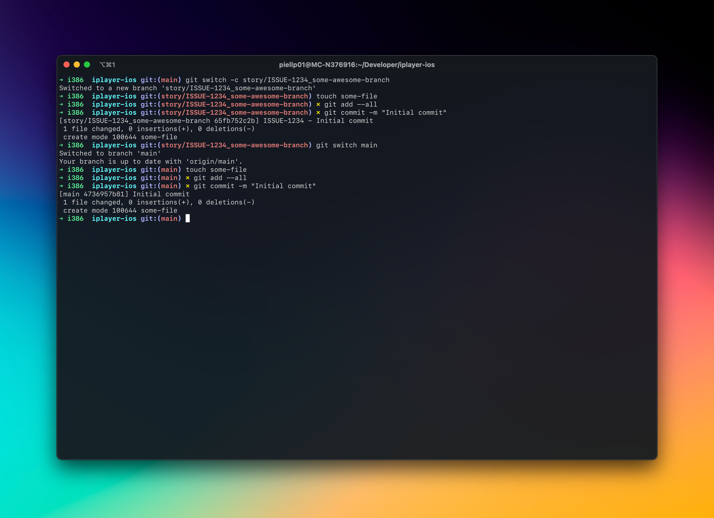

# 在Swift中编写脚本：Git Hooks

> [原文地址](https://www.polpiella.dev/scripting-in-swift-git-hooks#retrieving-the-ticket-number)

这周，我决定完成因为工作而推迟了一周的TODO事项来改进我的Git工作流程。

为了在提交的时候尽可能多的携带上下文信息，我们让提交信息包含了正在处理的JIRA编号。这样，将来如果有人回到我们现在正在提交的源代码，输入`git blame`，就能很容易的找出JIRA的编号。

每次提交都包含这些信息可能会有点乏味（如果你使用了类似[TDD](https://en.wikipedia.org/wiki/Test-driven_development)之类的方法，您会提交的更加频繁），而且，尽管像[Tower](https://www.git-tower.com/mac)这样的git客户端会让此变得容易一些，但是您仍然需要手动将问题编号复制粘贴到提交消息中，并且记住这样做，这是我最难以解决的问题😅。

出于这个原因，我开始寻求了解git hooks，试图自动化这项任务。我的想法是能够从git分支获取JIRA编号（我们有一个分支命名约定，形如：story/ISSUE-1234_branch-name），然后将提交消息更改为以JIRA编号为前缀，从而生成最终结果消息：ISSUE-1234-其他原本的提交信息。


# 用git hooks自动生成提交信息

**[Git Hooks](https://git-scm.com/book/en/v2/Customizing-Git-Git-Hooks)**提供了一种在运行某些重要的git命令时触发自定义操作的方法，例如在一次commit或者push之前执行一些操作。

在本例中，我使用了**`commit-msg`**钩子，它能够在当前提交信息生效前修改此信息。钩子由一个参数调用，该参数是指向包含用户输入的提交消息的文件的路径。这意味着，为了改变提交消息，我们只需要从文件中读取、修改其内容，然后写回调用挂钩的文件。

要创建git钩子，我们需要在**`.git/hooks`**路经下提供一个可执行脚本。我的钩子放在了**`.git/hooks/commit-msg`**路经之下。


# 为什么我使用Swift？

Git hooks可以使用任何你熟悉的，并且在主机上安装了解释器（通过`shebang`来指定）的脚本语言来编写。

虽然有很多更受欢迎的选项，比如`bash`、`ruby`等等，但我还是决定使用Swift。因为我对Swift更熟悉，因为我每天都在使用它，而且我真的非常喜欢它强大的类型语法以及低内存占用。


## 让我们开始吧

你可以使用任何你喜欢的IDE编写Swift脚本。但是如果你想要有适当的代码补全以及调试能力，你可以为其创建一个Xcode项目。为此，在**`macOS`**下选择**`Command Line Tool`**创建一个新的项目。


在创建的文件顶部加上Swift shebang，引入`Foundation`库。

``` swift
#!/usr/bin/swift
import Foundation
```

这样当git执行文件时，shebang将确保使用文件作为输入数据调用/usr/bin/swift二进制文件。


## 编写git钩子

项目已经全部设置好，所以现在可以编写git挂钩了。让我们走完所有的步骤。


### 检索提交消息

要做的第一件事就是从脚本传进来的参数检索临时提交文件的路径然后读取文件内容。

```swift
let commitMessageFile = CommandLine.arguments[1]

guard let data = FileManager.default.contents(atPath: commitMessageFile),
      let commitMessage = String(data: data, encoding: .utf8) else {
    exit(1)
}
```

在上面的代码片段中，我们首先拿到了提交文件的路径（`git`传递给脚本），然后通过`FileManagerAPI`读取了文件内容。如果因为一些原因检索失败了，我们退出（`exit`）脚本同时返回状态码`1`，这将告诉git终止此次提交。

---
**注意:**

根据[git hooks文档](https://git-scm.com/book/en/v2/Customizing-Git-Git-Hooks)，如果任何钩子脚本返回的状态码大于`0`，它都将终止即将要要发生的操作。这将在本文后面的部分中使用，以便在不需要做任何修改而优雅地退出。

---

### 检索问题编号

既然提交信息的字符串已经可用，接下来就需要找到当前分支并从中检索到问题编号。正如本文前面提到的，这只可能是因为团队对分支命名的严格格式，在其名称中始终包含JIRA编号（例如，**`story/ISSUE-1234_some-awesome-feature-work`**）。

为了实现这一点，我们必须检索当前的工作分支，然后用[正则表达式](https://nshipster.com/swift-regular-expressions/)从中检索问题编号。

让我们从添加脚本调用`zsh shell`命令的能力开始。通过使用`Process`api，脚本可以与`git`命令行界面交互。

```swift
func shell(_ command: String) -> String {
    let task = Process()
    let outputPipe = Pipe()
    let errorPipe = Pipe()
    
    task.standardOutput = outputPipe
    task.standardError = errorPipe
    task.arguments = ["-c", command]
    task.executableURL = URL(fileURLWithPath: "/bin/zsh")
    
    do {
        try task.run()
        task.waitUntilExit()
    } catch {
        print("There was an error running the command: \(command)")
        print(error.localizedDescription)
        exit(1)
    }
    
    guard let outputData = try? outputPipe.fileHandleForReading.readToEnd(),
          let outputString = String(data: outputData, encoding: .utf8) else {
        // Print error if needed
        if let errorData = try? errorPipe.fileHandleForReading.readToEnd(),
           let errorString = String(data: errorData, encoding: .utf8) {
            print("Encountered the following error running the command:")
            print(errorString)
        }
        exit(1)
    }
    
    return outputString
}
```

现在实现了`shell`命令，那么就可以使用它询问`git`当前分支是什么，然后尽可能的从中提取出问题编号。

```swift
let gitBranchName = shell("git rev-parse --abbrev-ref HEAD")
    .trimmingCharacters(in: .newlines)

let stringRange = NSRange(location: 0, length: gitBranchName.utf16.count)

guard let regex = try? NSRegularExpression(pattern: #"(\w*-\d*)"#, options: .anchorsMatchLines),
    let match = regex.firstMatch(in: gitBranchName, range: stringRange) else {
    exit(0)
}

let range = match.range(at: 1)

let ticketNumber = (gitBranchName as NSString)
    .substring(with: range)
    .trimmingCharacters(in: .newlines)
```

请注意，如果没有匹配项（即分支名称中不包含JIRA问题编号），脚本将以0的状态退出，允许提交继续进行，而不进行任何更改。这是为了不破坏诸如main或其他测试/调查分支中的工作流。


### 修改提交信息

为了更改提交消息，必须将脚本开头读取的文件内容（包含提交消息）写回同一路径。

在这种情况下，只需要做一个更改，即在提交信息的前面加上JIRA编号和（-），以将其与提交信息的其余部分很好地分开。还必须确保检查了提交信息字符串，仅在编号不存在时才添加编号：

```swift
if !commitMessage.contains(ticketNumber) {
    do {
        try "\(ticketNumber) - \(commitMessage.trimmingCharacters(in: .newlines))"
            .write(toFile: commitMessageFile, atomically: true, encoding: .utf8)
    } catch {
        print("Could not write to file \(commitMessageFile)")
        exit(1)
    }
}
```


### 设置git钩子

现在脚本已经准备好了，是时候把它放在git可以找到它的位置了。Git钩子可以全局设置，也可以基于单个repo设置。

我个人对这类脚本的偏好是基于单个repo设置，因为这样可以在出现问题时为您提供更多的控制和可见性，并且如果钩子开始失败，它会在它设置的repo中失败，而不是全局都失败。

要设置它们，我们只需要使文件可执行，重命名并将其复制到所要设置repo的**`.git/hooks/`**路径之下：

```shell
chmod +x main.swift
mv main.swift <path_to_your_repo>/.git/hooks/commit-msg
```


# 测试结果

现在repo已经全部设置好了，剩下的就是对部署的脚本进行测试。在下面的截屏中，创建了两个分支，一个带有问题编号，一个没有，它们有着相同的提交信息。可以看出脚本运行正常，并且只在需要时才更改提交消息！

